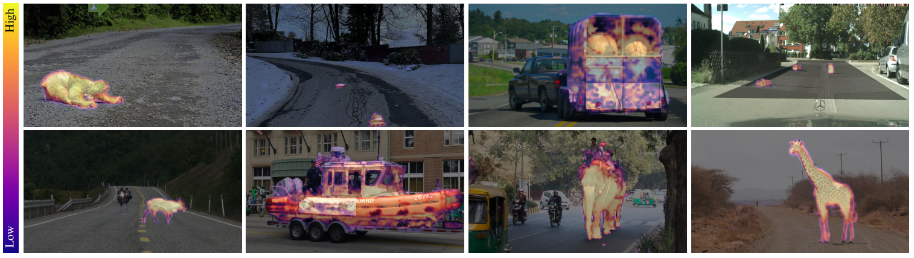

# Uncertainty-Aware Likelihood Ratio Estimation for Pixel-Wise Out-of-Distribution Detection

This repository contains the official implementation of our paper "Uncertainty-Aware Likelihood Ratio Estimation for Pixel-Wise Out-of-Distribution Detection"



## Installation
### Install Dependencies
```sh
conda env create -f environment.yml
```
### Prepare Datasets
Follow instructions at https://github.com/yyliu01/RPL/blob/main/docs/installation.md

## Training
Run training by executing:
```sh
sh code/train.sh
```


## Acknowledgement
We used and modified code parts from [PEBAL](https://github.com/tianyu0207/PEBAL) and [RPL](https://github.com/yyliu01/RPL). We like to thank the authors for making their code publicly available.